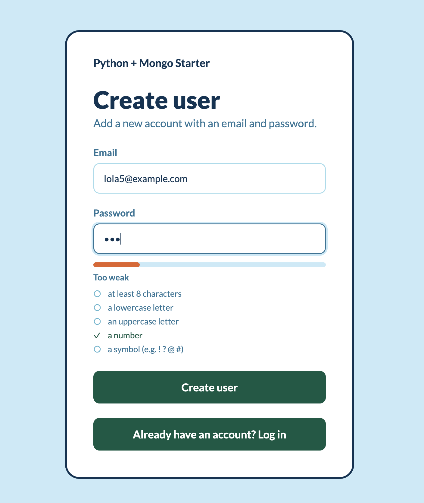

# Flask and Mongo Starter

A [Flask](https://flask.palletsprojects.com/en/stable) + [MongoDB](https://www.mongodb.com/docs/languages/python/) starter with session-based authentication and enforced password strength.

**Live demo:** [aise-flask-mongo.onrender.com](https://aise-flask-mongo.onrender.com) — hosted on Render's free tier, so after a period of inactivity the first request can take ~30–60 seconds while the service wakes up. The site shows a banner saying exactly that.

## User Docs

This app is deliberately small. Everything a user can do:

1. **Create an account** at `/users/new` with an email and a password. The password must meet **all five** strength rules — at least 8 characters, a lowercase letter, an uppercase letter, a number, and a symbol. A live meter shows which rules are still unmet as you type, and the server re-checks them on submit:

   

2. **Log in** at `/login` with that email and password.
3. **See yourself logged in** at `/users` — the page shows *your own* email and nothing else. There is no way to browse or list other users: each account can only ever see itself.
4. **Log out** with the button in the top-right corner.

That is the whole feature set: register → log in → see your own account → log out.

## Tech Docs

### Libraries

**Main dependencies** — used directly by the app:

| Library | Purpose |
| --- | --- |
| Flask | Web framework: routing, request handling, sessions, flash messages |
| pymongo | MongoDB driver; the `users` collection stores the accounts |
| Werkzeug | `generate_password_hash` / `check_password_hash` for salted password hashing (ships with Flask) |
| python-dotenv | Loads `.env` into environment variables at startup |
| certifi | CA certificate bundle so TLS connections to MongoDB Atlas verify |
| gunicorn | Production WSGI server used on Render (see `Procfile`) |

**Helper dependencies** — pulled in by the main ones:

| Library | Purpose |
| --- | --- |
| Jinja2 | Template engine Flask uses to render `templates/` |
| MarkupSafe | Escapes values in templates (protects against XSS) |
| itsdangerous | Cryptographically signs the session cookie so it cannot be tampered with |
| click | Powers the `flask` command-line interface |
| blinker | Signal/event system Flask uses internally |
| dnspython | Resolves `mongodb+srv://` Atlas connection strings |

**Dev dependency** — `pytest` (in `requirements-dev.txt`) runs the test suite.

### Database connection

[`app.py`](app.py) connects once at startup:

```python
client = MongoClient(
    MONGO_URI, tlsCAFile=certifi.where(), serverSelectionTimeoutMS=3000
)
db = client[DB_NAME]
users = db["users"]
```

- `tlsCAFile=certifi.where()` supplies the CA bundle Atlas needs for TLS; it is ignored for plain `mongodb://localhost` connections.
- `serverSelectionTimeoutMS=3000` makes an unreachable database fail after 3 s instead of hanging ~30 s. Every route catches `PyMongoError` and shows a friendly message instead of crashing:


### Password strength rules

[`password_strength.py`](password_strength.py) is the single source of truth. Each rule is a `(key, label, test)` tuple:

```python
REQUIREMENTS = [
    ("length", f"at least {MIN_LENGTH} characters", lambda p: len(p) >= MIN_LENGTH),
    ("lowercase", "a lowercase letter", lambda p: bool(re.search(r"[a-z]", p))),
    ("uppercase", "an uppercase letter", lambda p: bool(re.search(r"[A-Z]", p))),
    ("digit", "a number", lambda p: bool(re.search(r"\d", p))),
    ("symbol", "a symbol (e.g. ! ? @ #)", lambda p: bool(re.search(r"[^A-Za-z0-9]", p))),
]
```

`evaluate_password()` counts how many rules pass and only returns `acceptable=True` when **all** of them do. The browser meter in [`static/js/password-strength.js`](static/js/password-strength.js) mirrors these rules for live feedback, but it is only a convenience — it can be bypassed, which is why the server re-checks.

### Registration

[`create_user`](app.py) enforces the rules server-side, rejects duplicate emails, and never stores a plain password:

```python
result = evaluate_password(password)
if not result["acceptable"]:
    flash(
        "Password is not strong enough. It still needs: "
        + ", ".join(result["unmet"])
        + ".",
        "error",
    )
    return redirect(url_for("new_user"))

try:
    if users.find_one({"email": email}):
        flash("A user with that email already exists.", "error")
        return redirect(url_for("new_user"))

    users.insert_one(
        {
            "email": email,
            "password_hash": generate_password_hash(password),
        }
    )
except PyMongoError:
    flash("Database unavailable. Please try again later.", "error")
    return redirect(url_for("new_user"))
```

`generate_password_hash` produces a salted hash; the original password is never written anywhere.

### Login

[`login`](app.py) verifies the password against the stored hash and deliberately uses **one generic error** for both "no such user" and "wrong password", so the form does not reveal which emails are registered:

```python
if user is None or not check_password_hash(user["password_hash"], password):
    flash("Invalid email or password.", "error")
    return redirect(url_for("login"))

session["user_email"] = email
```

The session cookie is signed with `SECRET_KEY` (via `itsdangerous`), so users cannot forge a login by editing their cookie — **provided a real `SECRET_KEY` is set**. If the env var is missing, the app falls back to a dev-only default (`dev-secret-change-me`) that is public in this repo, so production deployments must set their own.

### Protecting routes

The `login_required` decorator wraps any route that needs a signed-in user:

```python
def login_required(view):
    """Redirect anonymous visitors to the login page."""

    @wraps(view)
    def wrapped(*args, **kwargs):
        if "user_email" not in session:
            flash("Please log in to continue.", "error")
            return redirect(url_for("login"))
        return view(*args, **kwargs)

    return wrapped
```

### The account page shows only you

`/users` looks up **only the signed-in user's own document** — it never queries the whole collection, so one account can never enumerate other users' emails:

```python
@app.route("/users")
@login_required
def account():
    """Show the signed-in user their own account only, never other users."""
    email = session["user_email"]
    try:
        current_user = users.find_one({"email": email})
    except PyMongoError:
        flash("Database unavailable. Please try again later.", "error")
        current_user = None
    return render_template("account.html", current_user=current_user)
```

### Render free-tier banner

A context processor exposes an `on_render` flag to every template. Render sets the `RENDER` env var automatically on its services, so the "this app may be sleeping" banner appears only on the deployed site, never in local development:

```python
@app.context_processor
def inject_deploy_flags():
    """Expose on_render so templates can show the free-tier deploy banner."""
    return {"on_render": bool(os.getenv("RENDER"))}
```

### Tests

[`tests/test_app.py`](tests/test_app.py) covers the password rules, registration, login protection, account-page privacy, and the deploy banner — **without a real MongoDB**. Each test swaps the module-level `users` collection for an in-memory fake:

```python
@pytest.fixture
def users_col(monkeypatch):
    fake = FakeCollection()
    monkeypatch.setattr(app_module, "users", fake)
    return fake
```

Run them with:

```bash
pip install -r requirements-dev.txt
pytest
```

CI ([`.github/workflows/ci.yml`](.github/workflows/ci.yml)) runs the same suite on every push to `main` and on every pull request.

## Running locally

### 1. Create a virtual environment

#### macOS / Linux

```bash
python3 -m venv .venv
source .venv/bin/activate
```

#### Windows (PowerShell)

```powershell
python -m venv .venv
.venv\Scripts\Activate.ps1
```

### 2. Install dependencies

```bash
pip install -r requirements.txt
```

After installing or upgrading packages, save the exact versions back:

```bash
pip freeze > requirements.txt
```

### 3. Configure the environment

Create a `.env` file (all optional for local development):

```bash
MONGO_URI=mongodb://localhost:27017   # or an Atlas mongodb+srv:// URI
MONGO_DB=py-mongo-starter
SECRET_KEY=...                        # required in production; generate with:
                                      # python -c "import secrets; print(secrets.token_hex(32))"
```

### 4. Run the app

```bash
python app.py
```

The app starts on [http://localhost:8000](http://localhost:8000). When you're done, leave the virtual environment with `deactivate`.

## Deployment

[`Procfile`](Procfile) tells Render (or Heroku) how to run the app in production:

```text
web: gunicorn app:app --bind 0.0.0.0:$PORT
```

Set `MONGO_URI`, `MONGO_DB`, and a real `SECRET_KEY` in the service's environment variables. Render sets `RENDER=true` on its own, which switches the free-tier banner on.

## Security notes

- Passwords are stored only as salted hashes (`generate_password_hash`), never in plain text.
- Login failures use one generic message so the form does not reveal registered emails.
- A signed-in user can only ever see their own account; there is no user listing.
- Sessions are only tamper-proof once a real `SECRET_KEY` is set: when the env var is unset, the app silently falls back to the public dev default in `app.py`.
- **Known limitation:** the registration form does reveal whether an email is already taken ("A user with that email already exists"). Fixing this properly needs a different signup flow (e.g. email confirmation), which is out of scope for this starter.
