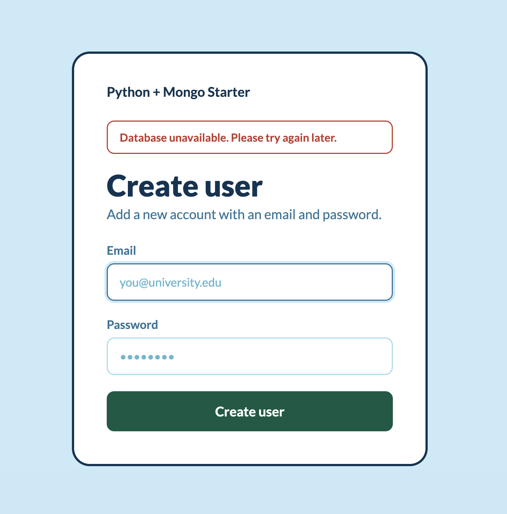

# Flask and Mongo Starter

A [Flask](https://flask.palletsprojects.com/en/stable) + [MongoDB](mongodb.com/docs/languages/python) starter project.

## How to create or run this starter project

### 1. Create a virtual environment

**macOS / Linux**

```bash
python3 -m venv .venv
source .venv/bin/activate
```

**Windows (PowerShell)**

```powershell
python -m venv .venv
.venv\Scripts\Activate.ps1
```

**Windows (Command Prompt)**

```cmd
python -m venv .venv
.venv\Scripts\activate.bat
```

Your shell prompt should now show `(.venv)`.

### 2. Install dependencies

```bash
pip install -r requirements.txt
```

or

```bash
pip install flask pymongo python-dotenv certifi
```

### 3. Freeze dependencies

After installing or upgrading packages, save the exact versions back to `requirements.txt`:

```bash
pip freeze > requirements.txt
```

### 4. Run the app

```bash
python app.py
```

The app starts on [http://localhost:8000](http://localhost:8000).

It needs a MongoDB database reachable at the `MONGO_URI` (defaults to
`mongodb://localhost:27017`). Without one, creating a user shows this error
instead of crashing:



## Authentication

The app has session-based authentication:

- **Register** at `/users/new`. New passwords must meet the strength rules in
  [`password_strength.py`](password_strength.py) (length + character variety).
  A live meter on the form shows progress as you type, but the server always
  re-checks — the browser meter can't be trusted on its own.
- **Log in** at `/login`. Passwords are verified against the stored hash with
  Werkzeug's `check_password_hash`.
- **Log out** with the button in the top-right once signed in.
- The user list at `/users` is protected by the `login_required` decorator and
  redirects anonymous visitors to the login page.

### Set a session secret

Sessions are signed with `SECRET_KEY`. The default (`dev-secret-change-me`) is
only for local development — set a real, random value in production, e.g. in a
`.env` file:

```bash
SECRET_KEY=$(python -c "import secrets; print(secrets.token_hex(32))")
```

## Deactivate

When you're done, leave the virtual environment:

```bash
deactivate
```
